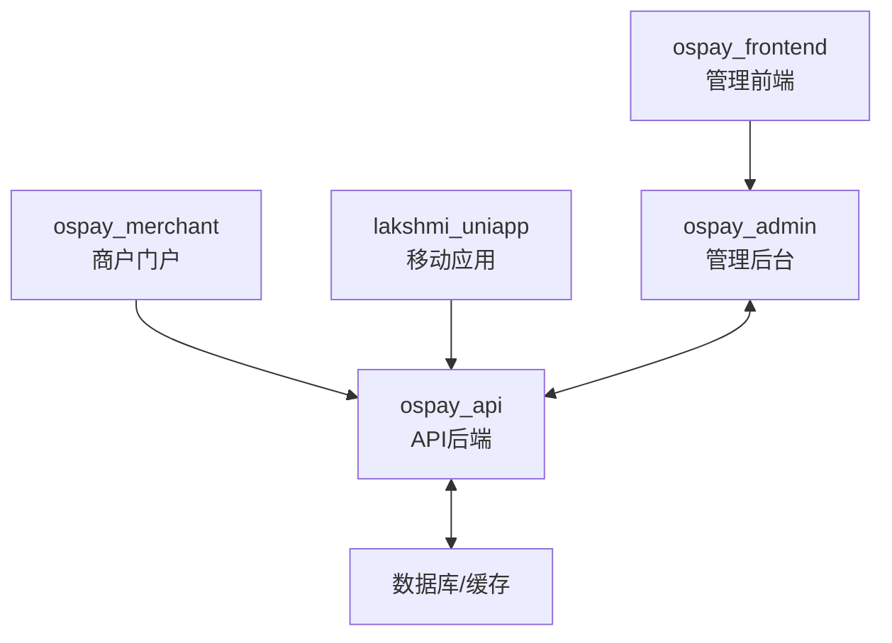

# OSPay开发环境搭建指南

## 目录

- [1. 项目概述](#1-项目概述)
- [2. 环境准备](#2-环境准备)
- [3. 基础服务安装](#3-基础服务安装)
- [4. 后端服务部署](#4-后端服务部署)
- [5. 前端应用部署](#5-前端应用部署)
- [6. 系统验证](#6-系统验证)
- [7. 常见问题与解决方案](#7-常见问题与解决方案)


## 1. 项目概述

### 1.1 项目介绍

OSPay是一个综合性支付管理平台，提供多渠道支付处理、商户管理、订单管理和资金结算等功能。该系统采用前后端分离架构，包含多个独立的组件，共同构成完整的支付生态系统。

OSPay主要功能包括：
- 支付处理：支持多种支付渠道和方式
- 商户管理：商户注册、审核和管理
- 订单管理：订单创建、查询和统计
- 资金结算：自动结算和资金流向追踪
- 报表分析：交易数据分析和可视化
- 用户管理：系统用户权限管理

### 1.2 系统架构

OSPay采用微服务架构设计，各组件之间通过API进行通信。系统整体架构如下：



系统采用以下技术栈：
- 后端：Python + Tornado框架
- 前端：Vue.js/React
- 数据库：MySQL
- 缓存：Redis
- 服务器：Nginx

### 1.3 组件说明

#### 1.3.1 ospay_admin (管理后台)

管理后台是系统的核心控制中心，主要负责处理管理员的请求和业务逻辑。

**主要功能**：
- 用户认证与授权
- 业务数据处理
- 系统配置管理
- 日志记录

**技术栈**：
- Python + Tornado框架
- aiomysql (异步MySQL客户端)
- aioredis (异步Redis客户端)
- bcrypt (密码加密)

#### 1.3.2 ospay_api (API后端)

API后端是系统的核心服务层，提供RESTful API接口，处理来自各个前端的请求。

**主要功能**：
- 支付处理
- 订单管理
- 商户API
- 数据查询
- WebSocket实时通信

**技术栈**：
- Python + Tornado框架
- SQLAlchemy ORM
- Redis异步客户端

#### 1.3.3 ospay_frontend (管理前端)

管理前端是系统管理员使用的Web界面，用于系统管理和监控。

**主要功能**：
- 系统管理界面
- 数据可视化
- 用户管理
- 配置管理

**技术栈**：
- Vue.js/React
- Element UI/Ant Design
- Axios
- ECharts

#### 1.3.4 ospay_merchant (商户门户)

商户门户是提供给商户使用的Web界面，用于商户管理自己的账户和交易。

**主要功能**：
- 商户注册和登录
- 交易查询
- 账户管理
- 结算查询

**技术栈**：
- Vue.js/React
- Element UI/Ant Design
- Axios

#### 1.3.5 lakshmi_uniapp (移动应用)

移动应用是基于uni-app框架开发的跨平台移动应用，提供移动端支付和账户管理功能。

**主要功能**：
- 移动支付
- 账户管理
- 交易记录
- 消息通知

**技术栈**：
- uni-app
- Vue.js
- uView UI

## 2. 环境准备

### 2.1 硬件要求

开发环境的硬件配置建议如下：

| 硬件 | 最低配置 | 推荐配置 |
|------|---------|---------|
| CPU  | 双核处理器 | 四核处理器或更高 |
| 内存 | 8GB RAM | 16GB RAM或更高 |
| 存储 | 128GB SSD | 256GB SSD或更高 |
| 网络 | 10Mbps带宽 | 100Mbps带宽或更高 |

### 2.2 软件要求

#### 2.2.1 操作系统

OSPay开发环境支持以下操作系统：

- **Linux**：Ubuntu 20.04 LTS或更高版本（推荐）
- **macOS**：Catalina (10.15)或更高版本
- **Windows**：Windows 10/11

#### 2.2.2 Git

Git用于代码版本控制和获取项目源码。

**安装步骤**：

1. **Linux (Ubuntu)**:
   ```bash
   sudo apt update
   sudo apt install git
   ```

2. **macOS**:
   ```bash
   # 使用Homebrew安装
   brew install git
   ```

3. **Windows**:
   - 下载并安装 [Git for Windows](https://git-scm.com/download/win)

**验证安装**：
```bash
git --version
```

#### 2.2.3 Python环境

OSPay后端服务基于Python 3.8+开发。

**安装步骤**：

1. **Linux (Ubuntu)**:
   ```bash
   sudo apt update
   sudo apt install python3 python3-pip python3-venv
   ```

2. **macOS**:
   ```bash
   # 使用Homebrew安装
   brew install python
   ```

3. **Windows**:
   - 下载并安装 [Python](https://www.python.org/downloads/windows/)
   - 确保将Python添加到PATH环境变量

**验证安装**：
```bash
python3 --version
pip3 --version
```

#### 2.2.4 Node.js环境

前端应用开发需要Node.js环境。

**安装步骤**：

1. **使用NVM安装（推荐，适用于所有平台）**:
   ```bash
   # 安装NVM
   curl -o- https://raw.githubusercontent.com/nvm-sh/nvm/v0.39.3/install.sh | bash
   # 或使用wget
   wget -qO- https://raw.githubusercontent.com/nvm-sh/nvm/v0.39.3/install.sh | bash
   
   # 安装Node.js
   nvm install 16
   nvm use 16
   ```

2. **直接安装**:
   - 从[Node.js官网](https://nodejs.org/)下载并安装

**验证安装**：
```bash
node --version
npm --version
```

## 3. 基础服务安装

### 3.1 MySQL数据库

OSPay使用MySQL作为主要的关系型数据库。

**安装MySQL**:

1. **Linux (Ubuntu)**:
   ```bash
   sudo apt update
   sudo apt install mysql-server
   sudo mysql_secure_installation
   ```

2. **macOS**:
   ```bash
   brew install mysql
   brew services start mysql
   ```

3. **Windows**:
   - 下载并安装 [MySQL Installer](https://dev.mysql.com/downloads/installer/)

**配置MySQL**:

1. 创建数据库和用户:
   ```sql
   CREATE DATABASE ospay CHARACTER SET utf8mb4 COLLATE utf8mb4_unicode_ci;
   CREATE USER 'ospay_user'@'localhost' IDENTIFIED BY 'your_password';
   GRANT ALL PRIVILEGES ON ospay.* TO 'ospay_user'@'localhost';
   FLUSH PRIVILEGES;
   ```

2. 配置MySQL服务:
   - 编辑MySQL配置文件 (my.cnf 或 my.ini)
   - 设置字符集为utf8mb4
   - 设置默认认证插件

**验证MySQL安装**:
```bash
mysql -u root -p
```

### 3.2 Redis缓存

OSPay使用Redis作为缓存和消息队列服务。

**安装Redis**:

1. **Linux (Ubuntu)**:
   ```bash
   sudo apt update
   sudo apt install redis-server
   sudo systemctl enable redis-server
   ```

2. **macOS**:
   ```bash
   brew install redis
   brew services start redis
   ```

3. **Windows**:
   - 下载 [Redis for Windows](https://github.com/tporadowski/redis/releases)
   - 解压并运行`redis-server.exe`

**配置Redis**:
- 编辑Redis配置文件 (redis.conf)
- 设置持久化选项
- 设置内存限制

**验证Redis安装**:
```bash
redis-cli ping
```

### 3.3 Nginx配置

Nginx用于反向代理和负载均衡。

**安装Nginx**:

1. **Linux (Ubuntu)**:
   ```bash
   sudo apt update
   sudo apt install nginx
   sudo systemctl enable nginx
   ```

2. **macOS**:
   ```bash
   brew install nginx
   brew services start nginx
   ```

3. **Windows**:
   - 下载 [Nginx for Windows](http://nginx.org/en/download.html)
   - 解压并运行`nginx.exe`

**配置Nginx**:

1. 创建API服务配置文件:
   ```nginx
   # /etc/nginx/sites-available/ospay_api.conf
   server {
       listen 8888;
       server_name localhost;

       location / {
           proxy_pass http://localhost:9000;
           proxy_set_header Host $host;
           proxy_set_header X-Real-IP $remote_addr;
           proxy_set_header X-Forwarded-For $proxy_add_x_forwarded_for;
       }

       location /ws {
           proxy_pass http://localhost:9000;
           proxy_http_version 1.1;
           proxy_set_header Upgrade $http_upgrade;
           proxy_set_header Connection "upgrade";
           proxy_set_header Host $host;
       }
   }
   ```

2. 启用配置:
   ```bash
   sudo ln -s /etc/nginx/sites-available/ospay_api.conf /etc/nginx/sites-enabled/
   sudo nginx -t
   sudo systemctl reload nginx
   ```

**验证Nginx安装**:
```bash
# 检查Nginx状态
nginx -t

# 访问默认页面
curl http://localhost:8888
```

## 4. 后端服务部署

### 4.1 ospay_api部署

#### 4.1.1 代码获取

首先，从Git仓库克隆ospay_api项目代码：

```bash
# 克隆项目代码
git clone https://github.com/baofeng16888/ospay_api.git
cd ospay_api
```

#### 4.1.2 配置文件设置

在运行服务前，需要配置相关的配置文件：

1. **创建配置文件**:
   ```bash
   # 复制示例配置文件
   cp config.example.py config.py
   ```

2. **编辑配置文件**:
   根据实际环境修改`config.py`文件中的配置参数，主要包括：
   
   ```python
   dev = dict(
       redis_host='localhost',  # Redis服务器地址
       mysql_host='localhost',  # MySQL服务器地址
       mysql_user='ospay_user', # MySQL用户名
       mysql_password='your_password',  # MySQL密码
       mysql_database='ospay',     # 数据库名称
       debug=False,               # 是否开启调试模式
       order_timeout=5,           # 订单超时时间
       pay_url='http://localhost:9000/order/',  # 支付URL
       key_order='xxxxxx',        # 订单密钥
       secret_key='xxxxxxx',      # 系统密钥
       autoreload=True,           # 是否自动重载
       rollbar_server_access_token='8b2e26232f564f9ab0a486cfa7288ee8',  # 日志服务token
       websocket_api_allow_host=['app_servers'],  # WebSocket允许的主机
       usdt_api_endpoint='https://data-center-staging.rubyxgem.com:2087/api/brave_troops/usdt/remits/place_order',  # USDT API端点
   )
   ```

#### 4.1.3 服务启动

启动ospay_api服务：

1. **创建虚拟环境**:
   ```bash
   python -m venv venv
   source venv/bin/activate  # Linux/macOS
   # 或
   venv\Scripts\activate  # Windows
   ```

2. **安装依赖**:
   ```bash
   pip install -r requirements.txt
   ```

3. **启动服务**:
   ```bash
   python main.py --port=9000
   ```

**使用Supervisor管理服务（推荐）**:

1. **安装Supervisor**:
   ```bash
   sudo apt update
   sudo apt install supervisor
   ```

2. **创建Supervisor配置**:
   ```bash
   sudo nano /etc/supervisor/conf.d/ospay_api.conf
   ```
   
   添加以下内容：
   ```ini
   [program:ospay_api]
   command=/path/to/ospay_api/venv/bin/python /path/to/ospay_api/main.py --port=9000
   directory=/path/to/ospay_api
   user=your_username
   autostart=true
   autorestart=true
   redirect_stderr=true
   stdout_logfile=/path/to/ospay_api/logs/supervisor.log
   ```

3. **启动服务**:
   ```bash
   sudo supervisorctl reread
   sudo supervisorctl update
   sudo supervisorctl start ospay_api
   ```

#### 4.1.4 数据库初始化

首次启动服务时，需要初始化数据库：

```bash
# 激活虚拟环境
source venv/bin/activate  # Linux/macOS
# 或
venv\Scripts\activate  # Windows

# 执行数据库初始化脚本
python -c "from application.lakshmi_api.models import create_tables; create_tables()"
```

**导入示例数据（可选）**:
```bash
mysql -u ospay_user -p ospay < sql/mysql.sql
```

### 4.2 ospay_admin部署

#### 4.2.1 代码获取

从Git仓库克隆ospay_admin项目代码：

```bash
# 克隆项目代码
git clone https://github.com/baofeng16888/ospay_admin.git
cd ospay_admin
```

#### 4.2.2 配置文件设置

ospay_admin需要配置数据库连接和其他系统参数：

1. **创建配置文件**:
   ```bash
   # 创建配置目录
   mkdir -p config
   
   # 创建配置文件
   touch config/config.py
   ```

2. **编辑配置文件**:
   在`config/config.py`中添加以下内容：
   
   ```python
   # 数据库配置
   DB_CONFIG = {
       'host': 'localhost',
       'port': 3306,
       'user': 'ospay_user',
       'password': 'your_password',
       'db': 'ospay',
       'charset': 'utf8mb4'
   }
   
   # Redis配置
   REDIS_CONFIG = {
       'host': 'localhost',
       'port': 6379,
       'db': 0,
       'password': None
   }
   
   # 系统配置
   SYSTEM_CONFIG = {
       'debug': True,
       'secret_key': 'your_secret_key',
       'cookie_secret': 'your_cookie_secret',
       'log_path': './logs',
       'api_url': 'http://localhost:8888'
   }
   ```

#### 4.2.3 服务启动

启动ospay_admin服务：

1. **创建虚拟环境**:
   ```bash
   python -m venv venv
   source venv/bin/activate  # Linux/macOS
   # 或
   venv\Scripts\activate  # Windows
   ```

2. **安装依赖**:
   ```bash
   pip install -r requirements.txt
   ```

3. **启动服务**:
   ```bash
   python main.py --port=8000
   ```

**使用Supervisor管理服务（推荐）**:

1. **安装Supervisor**:
   ```bash
   sudo apt update
   sudo apt install supervisor
   ```

2. **创建Supervisor配置**:
   ```bash
   sudo nano /etc/supervisor/conf.d/ospay_admin.conf
   ```
   
   添加以下内容：
   ```ini
   [program:ospay_admin]
   command=/path/to/ospay_admin/venv/bin/python /path/to/ospay_admin/main.py --port=8000
   directory=/path/to/ospay_admin
   user=your_username
   autostart=true
   autorestart=true
   redirect_stderr=true
   stdout_logfile=/path/to/ospay_admin/logs/supervisor.log
   ```

3. **启动服务**:
   ```bash
   sudo supervisorctl reread
   sudo supervisorctl update
   sudo supervisorctl start ospay_admin
   ```

## 5. 前端应用部署

### 5.1 ospay_frontend部署

#### 5.1.1 代码获取

从Git仓库克隆ospay_frontend项目代码：

```bash
# 克隆项目代码
git clone https://github.com/baofeng16888/ospay_frontend.git
cd ospay_frontend
```

#### 5.1.2 依赖安装

安装项目依赖：

```bash
# 安装依赖
npm install
# 或使用yarn
yarn install
```

#### 5.1.3 环境配置

配置前端环境变量：

1. **创建环境配置文件**:
   ```bash
   # 开发环境配置
   cp .env.example .env.development
   
   # 生产环境配置
   cp .env.example .env.production
   ```

2. **编辑环境配置文件**:
   在`.env.development`中设置API地址和其他配置：
   
   ```
   # API基础URL
   VUE_APP_BASE_API=http://localhost:8888
   
   # 应用标题
   VUE_APP_TITLE=OSPay管理系统
   
   # 开发服务器端口
   PORT=8080
   ```

#### 5.1.4 构建与部署

**开发环境运行**:

```bash
# 启动开发服务器
npm run serve
# 或使用yarn
yarn serve
```

**生产环境构建**:

```bash
# 构建生产版本
npm run build
# 或使用yarn
yarn build
```

**部署到Nginx**:

1. **配置Nginx**:
   创建Nginx配置文件`/etc/nginx/sites-available/ospay_frontend.conf`：
   
   ```nginx
   server {
       listen 80;
       server_name admin.ospay.local;  # 开发环境域名
       
       root /path/to/ospay_frontend/dist;
       index index.html;
       
       location / {
           try_files $uri $uri/ /index.html;
       }
       
       location /api {
           proxy_pass http://localhost:8888;
           proxy_set_header Host $host;
           proxy_set_header X-Real-IP $remote_addr;
       }
   }
   ```

2. **启用配置**:
   ```bash
   sudo ln -s /etc/nginx/sites-available/ospay_frontend.conf /etc/nginx/sites-enabled/
   sudo nginx -t
   sudo systemctl reload nginx
   ```

3. **配置本地hosts**:
   编辑`/etc/hosts`文件，添加：
   ```
   127.0.0.1 admin.ospay.local
   ```

### 5.2 ospay_merchant部署

#### 5.2.1 代码获取

从Git仓库克隆ospay_merchant项目代码：

```bash
# 克隆项目代码
git clone https://github.com/baofeng16888/ospay_merchant.git
cd ospay_merchant
```

#### 5.2.2 依赖安装

安装项目依赖：

```bash
# 安装依赖
npm install
# 或使用yarn
yarn install
```

#### 5.2.3 环境配置

配置前端环境变量：

1. **创建环境配置文件**:
   ```bash
   # 开发环境配置
   cp .env.example .env.development
   
   # 生产环境配置
   cp .env.example .env.production
   ```

2. **编辑环境配置文件**:
   在`.env.development`中设置API地址和其他配置：
   
   ```
   # API基础URL
   VUE_APP_BASE_API=http://localhost:8888
   
   # 应用标题
   VUE_APP_TITLE=OSPay商户系统
   
   # 开发服务器端口
   PORT=8081
   ```

#### 5.2.4 构建与部署

**开发环境运行**:

```bash
# 启动开发服务器
npm run serve
# 或使用yarn
yarn serve
```

**生产环境构建**:

```bash
# 构建生产版本
npm run build
# 或使用yarn
yarn build
```

**部署到Nginx**:

1. **配置Nginx**:
   创建Nginx配置文件`/etc/nginx/sites-available/ospay_merchant.conf`：
   
   ```nginx
   server {
       listen 80;
       server_name merchant.ospay.local;  # 开发环境域名
       
       root /path/to/ospay_merchant/dist;
       index index.html;
       
       location / {
           try_files $uri $uri/ /index.html;
       }
       
       location /api {
           proxy_pass http://localhost:8888;
           proxy_set_header Host $host;
           proxy_set_header X-Real-IP $remote_addr;
       }
   }
   ```

2. **启用配置**:
   ```bash
   sudo ln -s /etc/nginx/sites-available/ospay_merchant.conf /etc/nginx/sites-enabled/
   sudo nginx -t
   sudo systemctl reload nginx
   ```

3. **配置本地hosts**:
   编辑`/etc/hosts`文件，添加：
   ```
   127.0.0.1 merchant.ospay.local
   ```

### 5.3 lakshmi_uniapp部署

#### 5.3.1 代码获取

从Git仓库克隆lakshmi_uniapp项目代码：

```bash
# 克隆项目代码
git clone https://github.com/baofeng16888/lakshmi_uniapp.git
cd lakshmi_uniapp
```

#### 5.3.2 依赖安装

安装项目依赖：

```bash
# 安装依赖
npm install
# 或使用yarn
yarn install
```

#### 5.3.3 环境配置

配置uni-app环境：

1. **编辑配置文件**:
   修改`src/config/index.js`文件，设置API地址：
   
   ```javascript
   // 开发环境配置
   const development = {
     baseUrl: 'http://localhost:8888',
     websocketUrl: 'ws://localhost:8888/ws'
   }
   
   // 生产环境配置
   const production = {
     baseUrl: 'https://api.ospay.com',
     websocketUrl: 'wss://api.ospay.com/ws'
   }
   
   export default {
     development,
     production
   }
   ```

#### 5.3.4 构建与部署

**开发环境运行**:

1. **安装HBuilderX**:
   - 下载并安装 [HBuilderX](https://www.dcloud.io/hbuilderx.html)

2. **导入项目**:
   - 打开HBuilderX
   - 选择"导入"→"从本地目录导入"
   - 选择lakshmi_uniapp项目目录

3. **运行项目**:
   - 点击"运行"→"运行到浏览器"
   - 或点击"运行"→"运行到手机或模拟器"

**构建App**:

1. **配置App信息**:
   - 在HBuilderX中打开`manifest.json`
   - 配置应用名称、图标、版本等信息

2. **云打包**:
   - 点击"发行"→"原生App-云打包"
   - 选择平台（Android/iOS）
   - 配置证书信息
   - 点击"打包"

**构建H5版本**:

```bash
# 使用命令行构建H5版本
npm run build:h5
# 或使用yarn
yarn build:h5
```

**部署H5版本到Nginx**:

1. **配置Nginx**:
   创建Nginx配置文件`/etc/nginx/sites-available/lakshmi_uniapp.conf`：
   
   ```nginx
   server {
       listen 80;
       server_name app.ospay.local;  # 开发环境域名
       
       root /path/to/lakshmi_uniapp/dist/build/h5;
       index index.html;
       
       location / {
           try_files $uri $uri/ /index.html;
       }
       
       location /api {
           proxy_pass http://localhost:8888;
           proxy_set_header Host $host;
           proxy_set_header X-Real-IP $remote_addr;
       }
       
       location /ws {
           proxy_pass http://localhost:8888;
           proxy_http_version 1.1;
           proxy_set_header Upgrade $http_upgrade;
           proxy_set_header Connection "upgrade";
       }
   }
   ```

2. **启用配置**:
   ```bash
   sudo ln -s /etc/nginx/sites-available/lakshmi_uniapp.conf /etc/nginx/sites-enabled/
   sudo nginx -t
   sudo systemctl reload nginx
   ```

3. **配置本地hosts**:
   编辑`/etc/hosts`文件，添加：
   ```
   127.0.0.1 app.ospay.local
   ```

## 6. 系统验证

### 6.1 API服务测试

验证API服务是否正常运行：

```bash
# 检查API服务状态
curl http://localhost:8888/api/health

# 测试API接口
curl http://localhost:8888/api/v1/ping
```

**使用Postman测试API**:

1. 下载并安装 [Postman](https://www.postman.com/downloads/)
2. 导入API集合（如果有）
3. 测试关键API端点：
   - 用户认证
   - 订单创建
   - 支付处理
   - 数据查询

### 6.2 管理后台测试

验证管理后台是否正常运行：

1. 在浏览器中访问 http://admin.ospay.local
2. 使用默认管理员账号登录：
   - 用户名: admin
   - 密码: admin123
3. 测试关键功能：
   - 用户管理
   - 订单管理
   - 系统配置
   - 报表查询

### 6.3 商户门户测试

验证商户门户是否正常运行：

1. 在浏览器中访问 http://merchant.ospay.local
2. 使用测试商户账号登录：
   - 用户名: test_merchant
   - 密码: merchant123
3. 测试关键功能：
   - 账户管理
   - 交易查询
   - 结算管理
   - API密钥管理

### 6.4 移动应用测试

验证移动应用是否正常运行：

1. **H5版本测试**:
   - 在浏览器中访问 http://app.ospay.local
   - 使用测试账号登录
   - 测试主要功能

2. **App版本测试**:
   - 在模拟器或真机上安装测试版App
   - 使用测试账号登录
   - 测试主要功能，特别是支付流程

## 7. 常见问题与解决方案

### 7.1 数据库连接问题

**问题**: 无法连接到MySQL数据库

**解决方案**:
1. 检查MySQL服务是否正常运行：
   ```bash
   sudo systemctl status mysql
   ```

2. 检查数据库配置：
   - 确认配置文件中的数据库连接参数是否正确
   - 确认数据库用户名和密码是否正确
   - 确认数据库端口是否正确

3. 检查防火墙设置：
   ```bash
   sudo ufw status
   # 如果防火墙开启，允许MySQL端口
   sudo ufw allow 3306/tcp
   ```

### 7.2 Redis连接问题

**问题**: 无法连接到Redis服务

**解决方案**:
1. 检查Redis服务是否正常运行：
   ```bash
   sudo systemctl status redis
   ```

2. 检查Redis配置：
   - 确认配置文件中的Redis连接参数是否正确
   - 确认Redis端口是否正确

3. 重启Redis服务：
   ```bash
   sudo systemctl restart redis
   ```

### 7.3 API服务启动问题

**问题**: API服务无法正常启动

**解决方案**:
1. 检查日志文件：
   ```bash
   cat /path/to/ospay_api/logs/api.log
   ```

2. 检查配置文件：
   - 确认`config.py`文件是否存在
   - 确认配置参数是否正确

3. 检查依赖项：
   ```bash
   pip list
   ```

4. 检查端口占用：
   ```bash
   sudo lsof -i :9000
   ```

### 7.4 前端构建问题

**问题**: 前端项目构建失败

**解决方案**:
1. 检查Node.js版本：
   ```bash
   node -v
   # 如果版本不兼容，使用nvm切换版本
   nvm use 16
   ```

2. 清理缓存并重新安装依赖：
   ```bash
   rm -rf node_modules
   npm cache clean --force
   npm install
   ```

3. 检查构建错误信息：
   ```bash
   npm run build -- --verbose
   ```

4. 检查环境配置文件：
   - 确认`.env.development`或`.env.production`文件是否正确


```